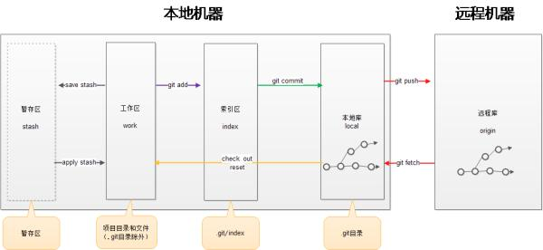

# git的基本命令


```git
#git版本信息
git -version 
#设置用户名
git config --global user.name "XXX"  
#设置邮箱
git config --global user.email "XXX@163.com" 

#将一个目录初始化为 Git 仓库
git init 

#添加文件到缓存
git add index.html 
#然后使用查看有何改动
git status -s
git status 
git diff 

#显示已写入缓存与已修改但尚未写入缓存的改动的区别
git diff 
#命令会告诉你有哪些内容已经写入缓存了
git diff --cached 
#查看已缓存的与未缓存的所有改动
git diff HEAD 

#提交的仓库
git commit -m '修改的备注'  


#查看每一次执行的命令
git reflog
git log


#回滚修改记录
#一个^回滚一次记录 
git reset --hard HEAD^^

#回滚数
git reset --hard HEAD~100

#回滚到指定ID
git reset --hard （id）

#取消缓存已缓存的内容
git reset HEAD

#列出可用的分支
git branch 
#创建新分支
git branch (branchname) 
#删除分支
git branch -d (branchname) 


#从远端仓库下载新分支与数据
git fetch 
```

## 新浪云
```git
git init
#在你应用的git代码目录里，添加一个新的git远程仓库 sae
git remote add sae https://git.sinacloud.com/wsjtest
#编辑代码并将代码部署到 `sae` 的版本1。
git add .
git commit -m 'Init my first app'
git push sae master:1
```

